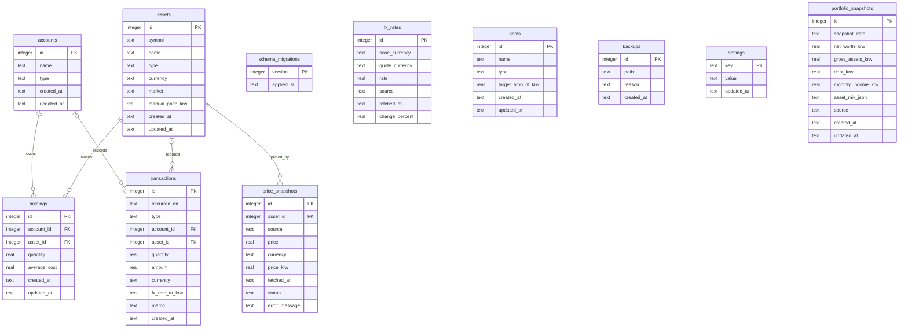

# DB ERD

이 문서는 `backend/src/portfolio_app/schema.sql`의 현재 SQLite 스키마를 기준으로 작성했습니다.
현재 애플리케이션 스키마 버전은 `7`입니다.

## 테이블 역할

| 테이블 | 역할 |
| --- | --- |
| `schema_migrations` | 적용된 스키마 버전을 기록합니다. 현재 `SCHEMA_VERSION = 7`입니다. |
| `accounts` | 현금, 적금, 증권, 가상자산 지갑, 부채 계좌를 저장합니다. |
| `assets` | 기본 현금/예금/부채 자산과 주식/ETF 같은 평가 대상 자산을 저장합니다. |
| `holdings` | 특정 계좌가 특정 자산을 얼마나 보유하는지 저장하는 현재 잔고 테이블입니다. |
| `transactions` | 입금, 출금, 매수, 매도, 배당, 이자, 수수료, 부채 상환, 조정 이력을 저장합니다. |
| `price_snapshots` | 자산별 수동 가격 또는 시장 데이터 동기화 결과를 시간순으로 저장합니다. |
| `fx_rates` | 외화 자산 평가에 사용할 환율과 선택적 전일대비 변경율 스냅샷을 저장합니다. |
| `goals` | 순자산 목표와 월 소득 목표를 저장합니다. |
| `backups` | 앱이 생성하거나 감지한 SQLite 백업 파일의 메타데이터를 저장합니다. |
| `settings` | 앱 설정을 key-value 형태로 저장합니다. |
| `portfolio_snapshots` | 성장기록 계산을 위해 KST 날짜별 순자산, 총자산, 부채, 월 소득, 자산 비중 스냅샷을 저장합니다. |

## 관계와 삭제 규칙

| 관계 | 제약 | 삭제 동작 |
| --- | --- | --- |
| `holdings.account_id` -> `accounts.id` | 필수 FK | 계좌 삭제 시 보유자산도 삭제됩니다. |
| `holdings.asset_id` -> `assets.id` | 필수 FK | 자산 삭제 시 보유자산도 삭제됩니다. |
| `transactions.account_id` -> `accounts.id` | 선택 FK | 계좌 삭제 시 거래 이력의 계좌 참조만 `NULL`이 됩니다. |
| `transactions.asset_id` -> `assets.id` | 선택 FK | 자산 삭제 시 거래 이력의 자산 참조만 `NULL`이 됩니다. |
| `price_snapshots.asset_id` -> `assets.id` | 필수 FK | 자산 삭제 시 가격 스냅샷도 삭제됩니다. |

## 주요 제약

| 대상 | 제약 |
| --- | --- |
| `accounts.type` | `cash`, `savings`, `brokerage`, `debt` 중 하나여야 합니다. |
| `assets.type` | `cash`, `savings`, `stock_etf`, `debt` 중 하나여야 합니다. |
| `assets.currency` | `USD`, `KRW` 중 하나여야 합니다. |
| `assets.market` | 현금, 예금, 부채처럼 시장이 없는 자산은 `NULL`일 수 있습니다. |
| `assets(symbol, market)` | `symbol`이 `NULL`이 아닐 때 같은 시장에서 중복될 수 없습니다. |
| `holdings(account_id, asset_id)` | 한 계좌와 한 자산 조합은 하나의 현재 잔고만 가질 수 있습니다. |
| `transactions.type` | `deposit`, `withdrawal`, `buy`, `sell`, `dividend`, `interest`, `fee`, `debt_payment`, `adjustment` 중 하나여야 합니다. |
| `transactions.currency` | `USD`, `KRW` 중 하나여야 합니다. |
| `price_snapshots.status` | `ok`, `stale`, `failed`, `manual` 중 하나여야 합니다. |
| `fx_rates(base_currency, quote_currency, fetched_at)` | 같은 시각의 동일 통화쌍 환율은 중복될 수 없습니다. |
| `fx_rates.base_currency`, `fx_rates.quote_currency` | 각각 `USD`, `KRW` 중 하나여야 합니다. |
| `goals.type` | `net_worth`, `monthly_income` 중 하나여야 합니다. |
| `portfolio_snapshots.snapshot_date` | 하루 하나의 성장기록만 저장하도록 고유해야 합니다. |
| `portfolio_snapshots.source` | `scheduled`, `manual`, `market_sync`, `import` 중 하나여야 합니다. |
| `portfolio_snapshots.gross_assets_krw`, `portfolio_snapshots.debt_krw`, `portfolio_snapshots.monthly_income_krw` | 0 이상이어야 합니다. |

## 주요 인덱스

| 인덱스 | 목적 |
| --- | --- |
| `idx_assets_symbol_market` | 심볼이 있는 자산의 같은 시장 내 중복 등록을 막습니다. |
| `idx_transactions_summary_holding_fx` | 요약 계산에서 보유자산별 최신 FX 적용 거래를 찾습니다. |
| `idx_transactions_summary_income_month` | 월별 배당과 이자 거래 합계를 빠르게 조회합니다. |
| `idx_transactions_summary_usd_fx` | USD 거래의 최신 유효 환율을 찾습니다. |
| `idx_price_snapshots_summary_asset_latest` | 자산별 최신 사용 가능 가격 스냅샷을 찾습니다. |
| `idx_fx_rates_summary_pair_latest` | 통화쌍별 최신 환율을 찾습니다. |

## 논리적 참조

`fx_rates`는 FK를 갖지 않습니다. 대신 요약 계산 시 `assets.currency`와 `fx_rates.base_currency`를 비교하고, `quote_currency = 'KRW'`인 최신 환율을 조회합니다.

`goals`도 다른 테이블을 직접 참조하지 않습니다. 목표 진행률은 런타임에 `holdings`, `assets`, `transactions`, `price_snapshots`, `fx_rates`를 바탕으로 계산한 순자산 또는 월 소득과 비교해 산출됩니다.

`portfolio_snapshots`도 FK를 갖지 않습니다. 스냅샷 생성 시점의 `PortfolioSummary` 결과를 저장하고, 성장기록 API는 `portfolio_snapshots`와 `transactions`의 입출금/배당/이자 흐름을 함께 사용해 월별 또는 연간 성장률을 계산합니다.
