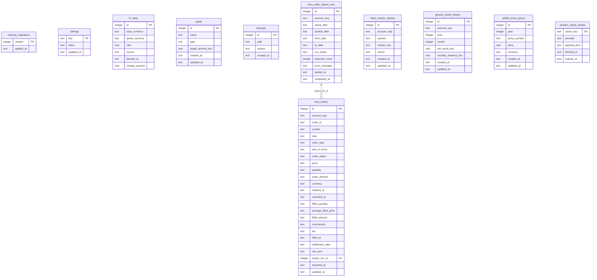

# DB ERD

이 문서는 `backend/src/portfolio_app/schema.sql`의 현재 SQLite 스키마를 기준으로 작성했습니다.
현재 애플리케이션 스키마 버전은 `16`입니다.

Toss account and holding data is not represented as local relational source
tables. It is fetched from Toss APIs at read time. Imported Toss order history is
a read-only local cache and does not drive holdings valuation. Growth month
history is manual Toss-account-scoped history keyed by Toss `account_seq`; it is
not a local holdings, transaction, or portfolio snapshot source table.
CAN SLIM analysis is derived from provider data and stores only response cache
entries in `canslim_cache_entries`.

## 테이블 역할

| 테이블 | 역할 |
| --- | --- |
| `schema_migrations` | 적용된 스키마 버전을 기록합니다. 현재 `SCHEMA_VERSION = 16`입니다. |
| `settings` | 앱 설정을 key-value 형태로 저장합니다. |
| `fx_rates` | Toss USD/KRW 환율과 선택적 전일대비 변경율 스냅샷을 저장합니다. |
| `goals` | 순자산 목표와 월 소득 목표를 저장합니다. |
| `backups` | 앱이 생성하거나 감지한 SQLite 백업 파일의 메타데이터를 저장합니다. |
| `toss_order_import_runs` | 계좌별 Toss 주문내역 가져오기 실행 상태와 실패 메시지를 저장합니다. |
| `toss_orders` | Toss 주문 응답을 `(account_seq, order_id)` 기준으로 upsert한 읽기 전용 주문내역 캐시입니다. |
| `chart_marker_memos` | Toss 계좌와 종목, 차트 마커 키별 판단 메모를 저장합니다. |
| `growth_month_history` | Toss `account_seq`별 수동 월간 성장 기록입니다. 연간 성장 기록은 이 테이블에서 연도별 마지막 저장 월을 선택해 파생합니다. |
| `sp500_proxy_prices` | `S&P 500 연 성장률` 계산용 VOO 연말 가격을 저장합니다. fresh schema와 v13→v14 migration은 2021~2025 VOO 연말 가격을 `insert or ignore`로 seed합니다. |
| `canslim_cache_entries` | FMP 기반 CAN SLIM 분석 응답 JSON을 `provider:symbol:range` 캐시 키로 저장합니다. |

## 제거된 로컬 원장 테이블

다음 테이블은 Toss-only brokerage slice에서 더 이상 fresh schema에 생성되지 않으며,
마이그레이션 v10에서 제거됩니다.

- `accounts`
- `assets`
- `holdings`
- `transactions`
- `price_snapshots`
- `portfolio_snapshots`
- legacy `import_runs`
- legacy `import_rows`

## 주요 제약

| 대상 | 제약 |
| --- | --- |
| `fx_rates(base_currency, quote_currency, fetched_at)` | 같은 시각의 동일 통화쌍 환율은 중복될 수 없습니다. |
| `fx_rates.base_currency`, `fx_rates.quote_currency` | 각각 `USD`, `KRW` 중 하나여야 합니다. |
| `goals.type` | `net_worth`, `monthly_income` 중 하나여야 합니다. |
| `goals.target_amount_krw` | 0보다 커야 합니다. |
| `toss_order_import_runs.status_filter` | `OPEN`, `CLOSED` 중 하나여야 합니다. |
| `toss_order_import_runs.run_status` | `running`, `success`, `failed` 중 하나여야 합니다. |
| `toss_order_import_runs.imported_count` | 0 이상이어야 합니다. |
| `toss_orders(account_seq, order_id)` | 계좌별 Toss 주문 식별자는 중복될 수 없습니다. |
| `toss_orders.import_run_id` | 참조한 가져오기 실행이 삭제되면 `NULL`로 보존됩니다. |
| `chart_marker_memos(account_seq, symbol, marker_key)` | 같은 계좌/종목/마커의 메모는 중복될 수 없습니다. |
| `growth_month_history.year` | 2000 이상 2099 이하이어야 합니다. |
| `growth_month_history.month` | 1 이상 12 이하이어야 합니다. |
| `growth_month_history.net_worth_krw` | 0 이상이어야 합니다. |
| `growth_month_history.monthly_dividend_krw` | 0 이상이어야 하며 기본값은 `0`입니다. |
| `growth_month_history(account_seq, year, month)` | 같은 Toss 계좌의 같은 연월 기록은 중복될 수 없습니다. |
| `sp500_proxy_prices.year` | 2000 이상 2099 이하이어야 합니다. |
| `sp500_proxy_prices.proxy_symbol` | 현재 ETF 프록시는 `VOO`만 허용합니다. |
| `sp500_proxy_prices.price` | 0보다 커야 합니다. |
| `sp500_proxy_prices.currency` | 현재 `USD`만 허용합니다. |
| `sp500_proxy_prices(proxy_symbol, year)` | 같은 프록시 ETF의 같은 연도 가격은 중복될 수 없습니다. |
| `canslim_cache_entries.cache_key` | CAN SLIM 캐시 항목의 고유 키입니다. 현재 API는 `fmp:analysis:{SYMBOL}:{market_range}` 형식을 사용합니다. |

## 주요 인덱스

| 인덱스 | 목적 |
| --- | --- |
| `idx_fx_rates_summary_pair_latest` | 통화쌍별 최신 환율을 찾습니다. |
| `idx_toss_orders_account_ordered_at` | 계좌별 주문내역을 주문 시각 역순으로 조회합니다. |
| `idx_toss_orders_account_status` | 계좌와 Toss 주문 상태별 조회를 보조합니다. |
| `idx_toss_orders_account_symbol` | 계좌와 종목별 주문내역 조회를 보조합니다. |
| `idx_chart_marker_memos_account_symbol` | 계좌와 종목별 차트 마커 메모 조회를 보조합니다. |
| `idx_growth_month_history_account_period` | Toss 계좌별 월간 성장 기록을 연월순으로 조회합니다. |
| `idx_sp500_proxy_prices_symbol_year` | 프록시 ETF별 연도순 가격 조회를 보조합니다. |

## 논리적 참조

`goals`는 다른 테이블을 직접 참조하지 않습니다. 목표 진행률은 런타임에
Toss holdings, Toss buying power, Toss USD/KRW 환율로 만든 `PortfolioSummary`와
비교해 산출됩니다.

`fx_rates`도 FK를 갖지 않습니다. Toss summary 계산에서 USD 보유자산이나 USD
buying power의 KRW 평가가 필요할 때 Toss FX provider가 반환한 환율을 사용할
수 있습니다.

`growth_month_history.account_seq`는 Toss 계좌 식별자를 저장하지만 로컬
`accounts` 테이블을 참조하지 않습니다. 월간 성장 기록은 사용자가 입력한
월말 순자산과 월 배당금의 수동 이력이며, 연간 성장 기록은 동일 계좌의 월간
이력에서 연도별 마지막 저장 월을 선택해 런타임에 계산됩니다. 이 테이블은
거래 기반 성장 기록, 로컬 보유자산, 또는 제거된 `portfolio_snapshots`를
복원하지 않습니다.

`sp500_proxy_prices`는 `growth_month_history`와 독립적인 벤치마크 가격표입니다.
연간 성장 기록 응답은 요청 계좌의 연도 목록에 맞춰 `year / previous year` VOO
가격 비율을 붙이며, 아직 끝나지 않은 현재 연도에는 값을 표시하지 않습니다.

`canslim_cache_entries`는 다른 로컬 테이블을 참조하지 않습니다. CAN SLIM API는
FMP 응답으로 분석 payload를 만들고, 같은 심볼/시장 범위 요청을 짧은 시간 안에
반복할 때 이 테이블의 JSON payload를 재사용합니다. `refresh=true` 요청은 캐시를
우회하고 성공한 응답으로 캐시를 갱신합니다.
