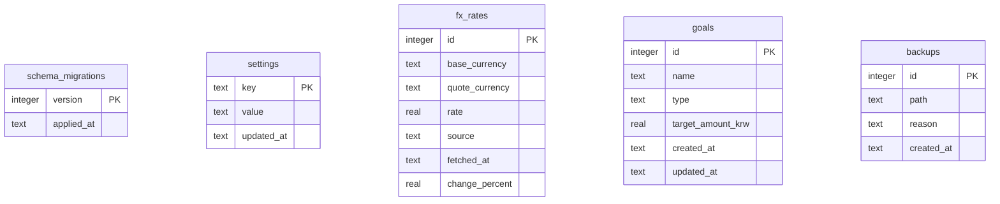

# DB ERD

이 문서는 `backend/src/portfolio_app/schema.sql`의 현재 SQLite 스키마를 기준으로 작성했습니다.
현재 애플리케이션 스키마 버전은 `10`입니다.

Toss account and holding data is not represented as local relational source
tables. It is fetched from Toss APIs at read time.

## 테이블 역할

| 테이블 | 역할 |
| --- | --- |
| `schema_migrations` | 적용된 스키마 버전을 기록합니다. 현재 `SCHEMA_VERSION = 10`입니다. |
| `settings` | 앱 설정을 key-value 형태로 저장합니다. |
| `fx_rates` | Toss USD/KRW 환율과 선택적 전일대비 변경율 스냅샷을 저장합니다. |
| `goals` | 순자산 목표와 월 소득 목표를 저장합니다. |
| `backups` | 앱이 생성하거나 감지한 SQLite 백업 파일의 메타데이터를 저장합니다. |

## 제거된 로컬 원장 테이블

다음 테이블은 Toss-only brokerage slice에서 더 이상 fresh schema에 생성되지 않으며,
마이그레이션 v10에서 제거됩니다.

- `accounts`
- `assets`
- `holdings`
- `transactions`
- `price_snapshots`
- `portfolio_snapshots`
- legacy `import_runs`
- legacy `import_rows`

## 주요 제약

| 대상 | 제약 |
| --- | --- |
| `fx_rates(base_currency, quote_currency, fetched_at)` | 같은 시각의 동일 통화쌍 환율은 중복될 수 없습니다. |
| `fx_rates.base_currency`, `fx_rates.quote_currency` | 각각 `USD`, `KRW` 중 하나여야 합니다. |
| `goals.type` | `net_worth`, `monthly_income` 중 하나여야 합니다. |
| `goals.target_amount_krw` | 0보다 커야 합니다. |

## 주요 인덱스

| 인덱스 | 목적 |
| --- | --- |
| `idx_fx_rates_summary_pair_latest` | 통화쌍별 최신 환율을 찾습니다. |

## 논리적 참조

`goals`는 다른 테이블을 직접 참조하지 않습니다. 목표 진행률은 런타임에
Toss holdings와 Toss USD/KRW 환율로 만든 `PortfolioSummary`와 비교해 산출됩니다.

`fx_rates`도 FK를 갖지 않습니다. Toss summary 계산에서 USD 보유자산의 KRW
평가가 필요할 때 Toss FX provider가 반환한 환율을 사용할 수 있습니다.
